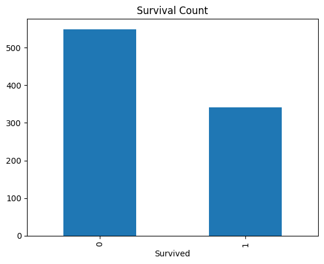
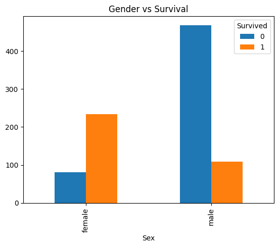

# Prodigy Infotech - Task 2

## 📊 Objective
Perform data cleaning and exploratory data analysis (EDA) on Titanic dataset.

## 📁 Dataset
Titanic dataset from Prodigy Infotech.

## 🧹 Data Cleaning
- Filled missing values in Age
- Filled missing values in Embarked
- Dropped Cabin column

## 📈 Exploratory Data Analysis
- Survival count visualization
- Gender vs survival analysis
- Age distribution analysis
- Passenger class vs survival

## 📷 Output

## 📌 Insights
- Females had higher survival rate than males
- Passengers in 1st class had better survival chances
- Most passengers were between age 20–40
- Survival rate varies based on class and gender
